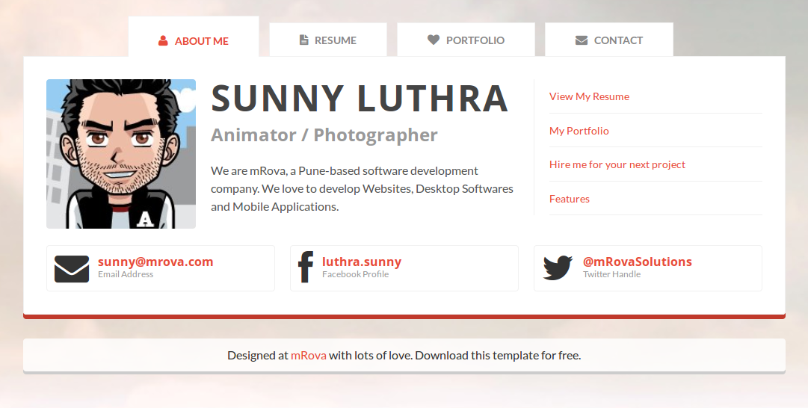

# Exercise 1 - Create About Me page

In this exercise we will create *About Me* page:



## Step 1 - Create *index.html* document

To have a valid HTML document, paste the following template in your new created file:

```html
<!DOCTYPE html>
<html lang="en">
    <head>
        <meta charset="UTF-8">
        <meta name="viewport" content="width=device-width, initial-scale=1.0">
        <meta http-equiv="X-UA-Compatible" content="ie=edge">
        <title>About Me</title>
    </head>
    <body>
    </body>
</html>
```

## Step 2 - Create *style.css* file and link it to HTML header

Create a new file (*style.css*).
To link your css file into a webpage, copy this code into the head of your HTML document, after [CSS reset](http://necolas.github.io/normalize.css/):

```html
<link rel="stylesheet" href="https://cdnjs.cloudflare.com/ajax/libs/normalize/7.0.0/normalize.min.css">
<link rel="stylesheet" href="style.css">
```

## Step 3 - Embed Google [Open Sans](https://fonts.google.com/specimen/Open+Sans?selection.family=Open+Sans:400,700) Font

### Embed Font

To embed your selected fonts into a webpage, copy this code into the `<head>` of your HTML document:

```html
<link href="https://fonts.googleapis.com/css?family=Open+Sans:400,700" rel="stylesheet">
```

### Specify in CSS

Use the following CSS rules to specify these families:

```css
html {
    font-family: 'Open Sans', sans-serif;
    color: #555;
}
```

## Step 4 - Background

Use the following CSS rules to add background to your page:

```css
body {
    background: url('../../img/background.jpg');
    background-repeat: no-repeat;
    background-attachment: fixed;
    background-position: center center;
    background-size: cover;
}
```

## Step 5 - Page Layout

Use the following HTML markup to create the document content:

```html
<div class="page-grid">
    <main class="about-content">
        
        <div class="my-info">
            <h1 class="my-info-title">SUNNY LUTHRA</h1>
            <h2 class="my-info-subtitle">Animator / Photographer</h2>
            <p class="my-info-content">We are mRova, a Pune-based software development company. We love to develop Websites, Desktop Softwares and Mobile Applications.</p>
        </div>
        <ul class="my-list">
            <li class="my-list-item"><a  class="my-list-link" href="">View My Resume</a></li>
            <li class="my-list-item"><a  class="my-list-link" href="">My Portfolio</a></li>
            <li class="my-list-item"><a  class="my-list-link" href="">Hire me for your next project</a></li>
        </ul>
        <div class="my-social">
        </div>
    </main>
    <footer class="footer">
        <p class="copyright">Designed with lots of love at mRova. </p>
    </footer>
</div>
```

Apply the following CSS rules to create a new layout for your page:

```css
.page-grid {
    margin: 100px 0;
    display: grid;
    grid-template-columns: 1fr 990px 1fr;
    grid-template-rows: fit-content fit-content;
    grid-template-areas:
        ". about-content ."
        ". footer .";
}

.about-content {
    grid-area: about-content;
    background: white;
}

.footer {
    grid-area: footer;
    margin-top: 30px;
    background: white;
}
```

## Step 6 - Content Layout

Now is the time to add some style and create your content layout.

Apply the following CSS rules to *.about-content*:

```css
.about-content {
    ...
    display: grid;
    grid-template-columns: 1fr 1fr 1fr;
    grid-gap: 20px;
    grid-template-rows: 1fr fit-content;
    grid-template-areas:
        "my-avatar my-info my-list"
        "my-social my-social my-social";
}
```

Create the following classes and add *grid-area* property:

```css
.my-avatar {
    grid-area: my-avatar;
}

.my-info {
    grid-area: my-info;
}

.my-list {
    grid-area: my-list;
}

.my-social {
    grid-area: my-social;
}
```

## Step 7 - Add font awesome

To embed Font Awesome icons, copy this code into the head of your HTML document:

```html
<link rel="stylesheet" href="https://cdnjs.cloudflare.com/ajax/libs/font-awesome/4.7.0/css/font-awesome.min.css">
```

## Step 8 - Social icons content

Let's add some content into *my-social* section:

```html
 <div class="my-social">
    <div class="my-social-item">
        <i class="fa fa-envelope my-icon" aria-hidden="true"></i>
        <a href="" class="my-icon-title">sunny@mrova.com</a>
        <p class="my-icon-subtitle">Email Address</p>
    </div>
    <div class="my-social-item">
        <i class="fa fa-facebook my-icon" aria-hidden="true"></i>
        <a href="" class="my-icon-title">sunny</a>
        <p class="my-icon-subtitle">Facebook Profile</p>
    </div>
    <div class="my-social-item">
        <i class="fa fa-twitter my-icon" aria-hidden="true"></i>
        <a href="" class="my-icon-title">sunny</a>
        <p class="my-icon-subtitle">Twitter Handle</p>
    </div>
</div>
```

and now let's style it:

```css
.my-social {
    grid-area: my-social;
    display: grid;
    grid-template-columns: repeat(3, 1fr);
    grid-gap: 20px;
}

.my-social-item {
    display: grid;
    grid-template-columns: 45px 1fr ;
    grid-template-rows: 45px fit-content;
    grid-template-areas:
        "my-icon my-icon-title"
        "my-icon my-icon-subtitle";
}

.my-icon {
    grid-area: my-icon;
}

.my-icon-title {
    grid-area: my-icon-title;
}

.my-icon-subtitle {
    grid-area: my-icon-subtitle;
}
```

## Step 9 - Final touches

In order to have a prettier view, use the following CSS rules:

### Containers

```css
.about-content {
    ...
    padding: 30px 20px;
    border: 1px solid #f1f1f1;
    box-shadow: 0px 6px #c0392b;
    border-radius: 0px 0px 4px 4px;
}
```

```css
.footer {
    ...
    text-align: center;
    padding: 15px;
    box-shadow: 0px 4px #ccc;
    border-radius: 4px;
}
```

### Copyright text

```css
.copyright {
    margin: 0;
}
```

### Avatar

```css
.my-avatar {
    ...
    justify-self: center;
    align-self: center;
}
```

### Information

```css
.my-info-title {
    margin: 0;
    font-size: 38px;
    font-weight: 700;
    text-transform: uppercase;
}

.my-info-subtitle {
    color: #999;
    font-size: 1.5em;
    line-height: 1em;
    margin: 0 0 1em 0;
}

.my-info-content {
    margin: 0;
    font-size: 1em;
    line-height: 1.5em;
    margin-bottom: 0;
}
```

### List

```css
.my-list {
    margin: 0 0 0 20px;
    padding-left: 20px;
    list-style-type: none;
    border-left: 1px solid #f1f1f1;
    align-self: center;
}
.my-list-item {
    padding: 10px 0;
    border-bottom: 1px solid #f1f1f1;
}
.my-list-link {
    color: #c0392b;
    text-decoration: none;
}
```

### Social

```css
.my-social-item {
    ...
    padding: 6px 6px 6px 10px;
    border: 1px solid #f1f1f1;
    border-radius: 4px;
}

.my-icon {
    ...
    font-size: 40px;
    align-self: center;
    justify-self: left;
}

.my-icon-title {
    ...
    text-decoration: none;
    color: #E74C3C;
    font-weight: 700;
}

.my-icon-subtitle {
    ...
    color: #999;
    font-size: 12px;
    margin: 5px 0 0 0;
}
```

## Step 10 - Responsive

In order to make our page to look good on all devices (desktops, tablets, and phones) we need to add/modify some css rules on appropriate breakpoints:

### Tablets

```css
@media (max-width: 990px) {
    .my-list {
        display: none;
    }
    .page-grid {
        display: block;
    }
    .about-content {
        grid-template-columns: 1fr 1fr;
        grid-template-rows: 1fr fit-content;
        grid-template-areas:
            "my-avatar my-info"
            "my-social my-social";
        border-radius: 0;
    }
    .footer {
        border-radius: 0;
    }
}
```

### Phones

```css
@media (max-width: 768px) {
    body {
        background: none;
    }
    .about-content {
        display: block;
    }
    .my-avatar {
        display: block;
        margin: 0 auto;
    }
    .my-info-title {
        margin-top: 15px;
        text-align: center;
    }
    .my-info-subtitle {
        text-align: center;
    }
    .my-social {
        display: block;
    }
    .my-social-item {
        margin-top:10px;
    }
    .footer {
        margin-top: 3px;
    }
}
```